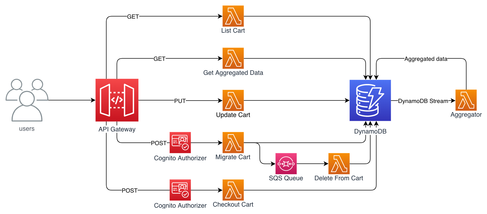

# Serverless Shopping Cart Microservice

This application is a sample application to demonstrate how you could implement a shopping cart microservice using serverless technologies on AWS. The backend is built as a REST API interface, making use of [Amazon API Gateway](https://aws.amazon.com/api-gateway/), [AWS Lambda](https://aws.amazon.com/lambda/), [Amazon Cognito](https://aws.amazon.com/cognito/), and [Amazon DynamoDB](https://aws.amazon.com/dynamodb/). The frontend is a Vue.js application using the [AWS Amplify](https://aws-amplify.github.io/) SDK for authentication and communication with the API.

To assist in demonstrating the functionality, a bare bones mock "products" service has also been included. Since the authentication parts are likely to be shared between components, there is a separate template for it. The front-end doesn't make any real payment integration at this time.

## Architecture



## Api Design

### Shopping Cart Service

GET  
`/cart`  
Retrieves the shopping cart for a user who is either anonymous or logged in.  

POST  
`/cart`  
Accepts a product id and quantity as json. Adds specified quantity of an item to cart.  

`/cart/migrate`  
Called after logging in - migrates items in an anonymous user's cart to belong to their logged in user. If you already have a cart on your logged in user, your "anonymous cart" will be merged with it when you log in.

`/cart/checkout`  
Currently just empties cart.

PUT  
`/cart/{product-id}`  
Accepts a product id and quantity as json. Updates quantity of given item to provided quantity.  

### Product Mock Service

GET  
`/product`  
Returns details for all products.  

`/product/{product_id}`  
Returns details for a single product.  

## Running the Example

### Requirements

python >= 3.8.0  
SAM CLI, >= version 0.33.1  
AWS CLI  
yarn  

### Deploy the Backend

Clone the project: `git clone <repo-url> && cd <repo-dir>`

You will need an s3 bucket which will be used for deploying source code to AWS. You can use an existing bucket, or create a new one with the AWS CLI:  `aws s3 mb s3://mybucketname`

Build and deploy the resources:  
``` bash
export S3_BUCKET=your-s3-bucket-name  # Just the name of the bucket, don't include "s3://"
make backend  # Deploys CloudFormation stacks for authentication, a product mock service and the shopping cart service.  
```

### Run the Frontend Locally

Start the frontend locally:  
``` bash
make frontend-serve  # Retrieves backend config from ssm parameter store to a .env file, then starts service.  
```

Once the service is running, you can access the frontend on http://localhost:8080/ and start adding items to your cart. You can create an account by clicking on "Sign In" then "Create Account". Be sure to use a valid email address as you'll need to retrieve the verification code.

**Note:** CORS headers on the backend service default to allowing http://localhost:8080/. You will see CORS errors if you access the frontend using the ip (http://127.0.0.1:8080/), or using a port other than 8080.  

## Clean Up
Delete the CloudFormation stacks created by this project:
``` bash
make backend-delete
```

## License

This library is licensed under the MIT-0 License. See the [LICENSE](LICENSE) file.  
